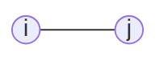
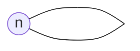
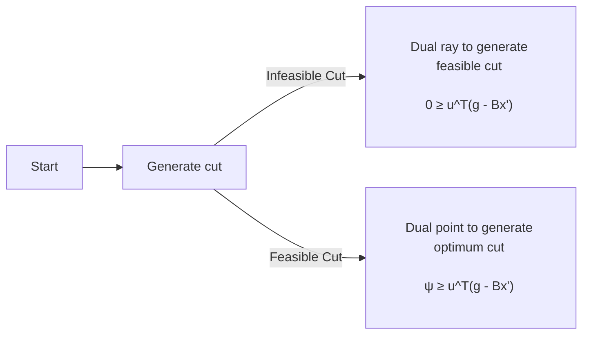
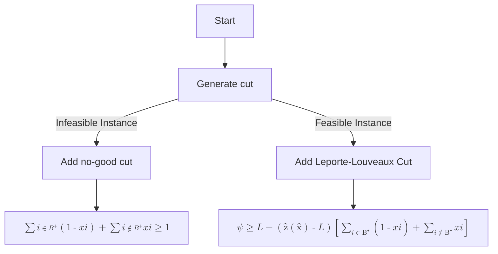
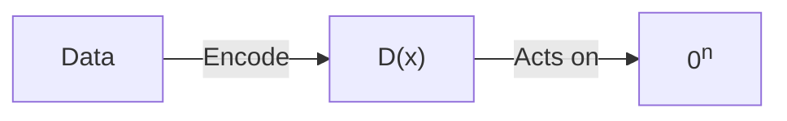

===

There was so much material I couldn't understand how to structure it properly, so I've just included my notes from each paper slightly cleaned up

### Index
1. **Error Mitigation in Short-Depth Quantum Circuits**: Using multiple runs of the same circuit at different noise levels to extrapolate the ideal expectation value.
2. **Circuit Knitting**: Partitioning a large quantum circuit into smaller subcircuits that can be executed separately.
3. **Overhead for simulating a non-local channel with local channels by quasiprobability sampling**: A metric for the overhead of simulating a non-local channel with local channels.
4. **Constructing a virtual two-qubit gate by sampling single-qubit operations**: A method to decompose two-qubit gates into sequences of single-qubit operations.
5. **Notes on Tensor Networks**: Quantum Circuits as Tensor Networks in MPS form.
6. **LoRA**: Low Rank Adaptation of Matrices for large models
7. **Benders Decomposition**: A method to decompose a MILP into smaller subproblems

### Error Mitigation in Short-Depth Quantum Circuits
The objective of these methods is to be applicable on NISQ devices and not take up extra resources thus being applicable immidiately

#### Richardson Extrapolation
Extrapolation to the zero noise limit: Cancels powers of the noise perturbations by an application of Richardson’s deferred approach to the limit.

+++
**NOTE**: Richardson extrapolation is basically just taking an integral in small boxes with some smart ways to account for the error term
The noisy circuit is run multiple times at different noise levels (λ) by rescaling the Hamiltonian params, then a linear combination of the results is taken to cancel out errors orders of magnitude smaller than the noise strength order-by-order.

#### Probabilistic Error Cancellation by Resampling
Probabilistic error cancellation by resampling randomized circuits according to a quasi-probability distribution.

The ideal circuit is represented as a quasi-probabilistic mixture of noisy ones. By sampling this distribution, the ideal expectation value can be estimated from the noisy circuits.

The simulation overhead here depends on how well the noisy gates can approximate the ideal gates.

#### Comparison
In summary, the first method relies on controlling noise levels and extrapolating results, while the second constructs a noise model and samples from it. Both provide ways to mitigate errors and improve accuracy without requiring additional qubits. The applicability depends on having short circuit depths and sufficiently well-characterized noise.

### Circuit Knitting
Circuit knitting is a technique for partitioning a large quantum circuit into smaller subcircuits that can be executed separately. This will be crucial for near-term quantum computers with limited qubits.

/======

The cost scales exponentially with the number of cuts, so minimizing this is important. This can usually be done in 2 ways
- Gate cuts (cutting multi-qubit gates across)
- Wire cuts (cutting wires in time)

#### Wire Cutting
One approach to doing this is to perform *random exchanges of non-local gates accross subcircuits with local operations*. This will allow us to estimate the ideal expectation value of the original circuit, with an increased variance which in turn can be mitigate by increasing the number of shots.

Let a non local gate be written as
$$
\begin{aligned}
  \mathcal{U}=\sum_{i}a_{i}\mathcal{F}_{i}\
\end{aligned}
$$
where $\mathcal{F}_i$ are local gates. Then the sampling overhead is given be $k^2=(\sum_i |a_i|)^2$ . It is therefore in our interest to find a decomposition with a small $k$

Older Approaches
- **Penget al.** - Tensor network decomposition of the circuit. The tensor network is divided into individual clusters which are contracted individually and combined in post-processing. This can be seen as a special instance of quasiprobability simulation.
- **Mitarai and Fujii** - Gate cutting based on quasiprobability simulation for a large variety of two-qubit gates.
- **Entanglement Forging** - The Schmidt decomposition of a state is a decomposition into a set of local circuits. This can be used to generate a set of local circuits to sample from. The drawback of this approach is that generally the Schmidt coefficients of a state are not known. The authors argue that in the case of a variational circuit preparing a ground state, these Schmidt coefficients can be treated in a variational way and optimized together with the parameters of the variational circuit.
+++
Here however, we will focus on the approach of **quasiprobability simulation**. The idea is to simulate the non-local gate by a local circuit with a probability distribution over the local circuits. The surprise here is that it seems if multiple gates are cut at once, the sampling overhead can be improved. i.e 2 CNOT gates cut > 1 CNOT gate cut twice.

#### Few imp results
- There is no advantage in cutting multiple wires at once without classical communication.
- It is possible do to a full state transfer of $n$ qubits via purely LOCC operations using $n$ bell pairs. Using this it is possible to derive an upper bound for the sampling overhead at $2^{n+1} - 1$ for the $\gamma$ -factor of $n$ bell pairs.
- The sampling overhead $4^{2n}$ for $n$ qubits is derived froma Quantum Teleportation protocol. The authors contest that this is applicable even in a more general setting. The bell states can be sampled before time OR when the cut occurs. Therefore we can create a small memory $k\le 2n$ and reuse that memory once all bell pairs run out. This gives a sampling overhead of $(2k + 1 - 1)^{1/k}$ for $k$ wire cuts. This is a bit like an Object Pool in Java.
- It is also worth noting that if wire cutting & gate cutting are both teleportation-based then they can share the same entanglement factory.

### Overhead for simulating a non-local channel with local channels by quasiprobability sampling
This paper is about of method to decompose non-local channels into local ones via quasiprobability sampling.

First a metric called `channel robustness of non-locality` is defined which is used to calculate the simulation overhead. A lower value &rarr; more efficient simulation.

/======

While it is non-trivial to calculate this quantity in general, an upper bound $W(u)$ is derived for two-qubit unitary channels. For 2-qubit channels this is done by constructing a unitary of a general 2-qubit unitary into local channels using single qubit rotations and projective measurements.

Some important pre-calculated values of W are
| Configuration | Value |
| --- | --- |
| Theoretical Maxima | 8.87 |
| Maximal Entanglement | 3 |
| Swap Gate | 7 |

We have also been given the result that for 2 quantum channels $\Phi_1$ & $\Phi_2$
$$
\begin{align}
\text{if}\quad \Phi_{21} = \Phi_2 \Phi_1 \\
\text{then} \quad W_{\Phi_{21}} \le W_{\Phi_2}W_{\Phi_1}
\end{align}
$$

where
$$
W(U) = 1 + \sum_{\alpha \ne\alpha'}(|u_\alpha u_{\alpha'}^* + u_{\alpha'} u_\alpha^*| + |u_\alpha u_{\alpha'}^* - u_{\alpha'} u_\alpha^*|)
$$
and $u_\alpha$ ('non-locality coefficients') is calculated from the decomposition of $U$ as follows
$$
U = \sum_{\alpha = 0}^3(u_\alpha \sigma_\alpha \otimes \sigma_\alpha) \because\quad \sum_\alpha |u_\alpha|^2 = 1
$$

### Constructing a virtual two-qubit gate by sampling single-qubit operations
The paper proposes a method to decompose two-qubit gates into sequences of single-qubit operations. This is done by expressing the superoperator of the two-qubit gate as a sum of tensor products of single-qubit superoperators.

The number of samples required to get the expectation of an observable with an error $\epsilon$ is $O(9^k/\epsilon^2)$ where $k$ is the number of cuts. This is a significant improvement over the $O(49^k/\epsilon^2)$ required by the previous method.

+++
This comes from, given two single qubit operators $A_1$ & $A_2$ and a two qubit operator $A_1 \otimes A_2$ we can write the superoperator of the two qubit operator as

#### A. Virtual two-qubit gate
$$
\begin{aligned}
&\mathcal{S}(e^{i\theta A_1\otimes A_2}) = \cos^2\theta\mathcal{S}(I\otimes I) \\
&\quad+ \sin^2\theta\mathcal{S}(A_1\otimes A_2) \\
&\quad+ \frac{1}{8}\cos\theta\sin\theta\sum_{(\alpha_1,\alpha_2)\in\{\pm 1\}^2}\alpha_1\alpha_2 \\
&\quad\left[\mathcal{S}((I+\alpha_1A_1)\otimes(I+i\alpha_2A_2))\right. \\
&\quad\quad\left.+\mathcal{S}((I+i\alpha_1A_1)\otimes(I+\alpha_2A_2))\right]
\end{aligned}
$$

#### B. Virtual two-qubit measurement

$$
\begin{aligned}
&\mathcal{S}(I+A_1\otimes A_2) = \mathcal{S}(I\otimes I) + \mathcal{S}(A\otimes A) \\
&\quad+ \frac{1}{8}\sum_{(\alpha_1,\alpha_2)\in\{\pm 1\}^2}\alpha_1\alpha_2 \\
&\quad\left[\mathcal{S}((I+\alpha_1A_1)\otimes(I+\alpha_2A_2))\right. \\
&\quad\quad\left.+\mathcal{S}((I+i\alpha_1A_1)\otimes(I+i\alpha_2A_2))\right]
\end{aligned}
$$

This method can now be used to perform breaks into 2-qubit gates at critical points and completely divide a large circuit into smaller ones. This **has** to be black magic of the highest order.

### Circuit knitting with classical communication
This paper presents new techniques for simulating large quantum circuits using smaller quantum devices, by partitioning the circuit into subcircuits and replacing nonlocal gates with local operations aided by classical communication

The general idea is that when splitting a circuit, allowing classical communication between the subcircuits can significantly reduce the sampling overhead. This is because it allows us to generate required entangled states jointly instead of individually

For clifford gates, the sampling overhead can be reduced from $O(49^k)$ to $O(9^k)$ where $k$ is the number of cuts. This is a significant improvement over the $O(49^k)$ required by the previous method.

/======

**Definations**
1. **Local Operations i.e $LO$**: The two computers can only realize operations in a product form $A \otimes B$ where $A$ and $B$ act locally on $\tilde{A}$ and $\tilde{B}$ , respectively.
2. **Local Operations and one-way Classical Communication i.e $LO\overrightarrow{CC}$**: The two computers can realize protocols that contain local operations from LO as well as classical communication from $\tilde{A}$ to $\tilde{B}$
3. **Local Operations and Classical Communication i.e $LOCC$**: The two computers can realize protocols that contain local operations from LO as well as two-way classical communication between $\tilde{A}$ and $\tilde{B}$

Note here that $LO$ & $LO\overrightarrow{CC}$ can be done on the same quantum computer.

This is also the paper that defines the $\gamma$ -factor which is the overhead of simulating a non-local gate using local operations. The $\gamma$ -factor satisfies useful properties like invariance under local unitaries.

### Notes on Tensor Networks
#### Penrose Notation
The most superior form of notation for tensor networks is the Penrose notation. It is a graphical notation that allows us to represent tensors and tensor contractions in a very intuitive way. It is also very compact and easy to work with. The notation is based on the following rules:

1. A tensor is represented by a shape with legs. The number of legs is the rank of the tensor. Example

  <!-- vector -->
  <svg width="100" height="100" viewbox="0 0 100 100">
    <circle cx="25" cy="50" r="25" stroke-width="1" fill="#2af" />
    <text x="50" y="90" text-anchor="middle" alignment-baseline="middle" fill="#fff">Vector</text>
    <line x1="50" y1="50" x2="90" y2="50" stroke="#888" stroke-width="4" />
  </svg>
  <!-- matrix -->
  <svg width="100" height="100" viewbox="0 0 100 100">
    <circle cx="50" cy="50" r="25" stroke-width="1" fill="#2af" />
    <text x="50" y="90" text-anchor="middle" alignment-baseline="middle" fill="#fff">Matrix</text>
    <line x1="75" y1="50" x2="100" y2="50" stroke="#888" stroke-width="4" />
    <line x1="0" y1="50" x2="25" y2="50" stroke="#888" stroke-width="4" />
  </svg>
  <!-- 3-tensor -->
  <svg width="100" height="100" viewbox="0 0 100 100">
    <circle cx="50" cy="50" r="25" stroke-width="1" fill="#2af" />
    <text x="50" y="90" text-anchor="middle" alignment-baseline="middle" fill="#fff">3-Tensor</text>
    <line x1="75" y1="50" x2="100" y2="50" stroke="#888" stroke-width="4" />
    <line x1="0" y1="50" x2="25" y2="50" stroke="#888" stroke-width="4" />
    <line x1="50" y1="0" x2="50" y2="25" stroke="#888" stroke-width="4" />
  </svg>

+++
2. A tensor contraction is represented by connecting the legs of two tensors. Example

<!-- vector inner product -->

<!-- matrix trace -->

<!-- cp decomp i.e sum_j T_ijk.v_j -->

<svg width="100" height="100" viewbox="0 0 100 100">
    <circle cx="20" cy="50" r="20" stroke-width="1" fill="#2af" />
    <circle cx="80" cy="50" r="20" stroke-width="1" fill="#2af" />
    <line x1="40" y1="50" x2="60" y2="50" stroke="#888" stroke-width="4" />
    <line x1="20" y1="0" x2="20" y2="30" stroke="#888" stroke-width="4" />
    <line x1="20" y1="70" x2="20" y2="100" stroke="#888" stroke-width="4" />
</svg>

  
Vec Inner-Prod

  
Matrix Trace

  

  CP-Decomp  
  i.e. ΣjTijk vj
  

3. Low rank structure of matrices (assuming the properties we need are sparsely laid out) (**SEE LoRA notes first**)

The idea of LoRA can be generally extended to represent an N-tensor as a chained SVD

<!-- 4 tensor i.e circle with 4 spokes -->
<svg width="100" height="100" viewbox="0 0 100 100">
  <circle cx="50" cy="50" r="25" stroke-width="1" fill="#2af" />
  <line x1="75" y1="50" x2="100" y2="50" stroke="#888" stroke-width="4" />
  <line x1="0" y1="50" x2="25" y2="50" stroke="#888" stroke-width="4" />
  <line x1="50" y1="0" x2="50" y2="25" stroke="#888" stroke-width="4" />
  <line x1="50" y1="75" x2="50" y2="100" stroke="#888" stroke-width="4" />
</svg>

No Change

&rarr;

<!-- 4 tensor expanded -->
<svg width="100" height="100" viewbox="0 0 100 100">
  <rect x="2" y="20" width="96" height="20" rx="5" fill="#2af" />
  <line x1="14" y1="40" x2="14" y2="60" stroke="#888" stroke-width="4" />
  <line x1="38" y1="40" x2="38" y2="60" stroke="#888" stroke-width="4" />
  <line x1="62" y1="40" x2="62" y2="60" stroke="#888" stroke-width="4" />
  <line x1="86" y1="40" x2="86" y2="60" stroke="#888" stroke-width="4" />
</svg>

Post SVD

&rarr;

<svg width="100" height="100" viewbox="0 0 110 100">
    <circle cx="10" cy="50" r="10" stroke-width="1" fill="#2af" />
    <line x1="20" y1="50" x2="30" y2="50" stroke="#888" stroke-width="4" />
    <circle cx="40" cy="50" r="10" stroke-width="1" fill="#2af" />
    <line x1="50" y1="50" x2="60" y2="50" stroke="#888" stroke-width="4" />
    <circle cx="70" cy="50" r="10" stroke-width="1" fill="#2af" />
    <line x1="80" y1="50" x2="90" y2="50" stroke="#888" stroke-width="4" />
    <circle cx="100" cy="50" r="10" stroke-width="1" fill="#2af" />
    <line x1="10" y1="60" x2="10" y2="80" stroke="#888" stroke-width="4" />
    <line x1="40" y1="60" x2="40" y2="80" stroke="#888" stroke-width="4" />
    <line x1="70" y1="60" x2="70" y2="80" stroke="#888" stroke-width="4" />
    <line x1="100" y1="60" x2="100" y2="80" stroke="#888" stroke-width="4" />
</svg>

This method also helps in size reduction of the amount of numbers we have to store more generally

While there are other representations of tensors other than Matrix Product State (MPS) such as Heirarchical Tucker (HT) and PEPS. We find this to be the most intuitive for Quantum Computing.

#### Circuit Representation
The magic about MPS is that when a circuit diagram is viewed such as

/======

This is already in MPS form. If we read it LTR, where all start qubits are 1-tensors (vectors) i.e of form $[0\quad1]^T$ which are in outer product with each other.

As they go, all single qubit gates are matrices $-◻-$ which apply a 2-tensor on each vector and finally mutli-qubit gates exist similarly so say a 2 qubit op with 4 lines coming out from it is $=◻=$ which applies a 4-tensor on each vector.

After a few layers writing down the exact tensors states in penrose expanded matrix notation becomes close to impossible and thus the circuit representation is used. The state in general would be an abritrary tensor of width the same as the number of qubits

There is a good change we discover a mechanism to write down the arbitrary tensor [from State 2](#MultiSVD) as [State 3](#MultiSVD) in a more compact way

### LoRA
Consider a situation where we need to make special models for something general
Ex.
- A voice recognition model for specific languages
- An LLM which is trained for a specific purpose
- A stable diffusion model which can generate a specific art style

#### Idea
Consider the situation where the model has large dimension $m\times n$ and we want to make it recognise multiple languages.
+++

We can create one general model which can recognise speech generally and then create "adapters" which can adapt to individual languages. This is the idea behind LoRA. The reason to why we don't train them directly is because of "catastrophic forgetting" where models tend to "forget" old data when dumped with too much distinct information

So we train a base model and then add on small weights which can modify this behavior. The assumtpion behind here is that 'specific' tasks require a much sparser feature set from the full model so rank decomposition can effectively modify only those features

#### Algorithm
Let there exist weights $W$ of a matrix which we need to modify to $W'$ such that
- $W$ is the base model
- $W'$ is the specialised model

let
$$W' = W + BA\quad\because\quad B, A \in \text{lower rank}$$

So for example if $|W| = 2048x2048$ then assuming the decomposition rank is 4 we can write $W'$ as $W' = W + BA$ where $B$ is $2048x4$ and $A$ is $4x2048$

#### Training
We initialise both $A, B$ as follows

$$
\begin{split}
A &= \mathcal{N}(0, \sigma^2)\\
B &= 0
\end{split}
$$

Now when the loss is calculated we don't touch $W$ at all but rather backprop on $A, B$ to modify them. This is because we want to keep the base model intact and only modify the weights which are added on top of it for specialisation. This also reduces training time since $A,B$ are much smaller matrices and therefore the number of weights we train are much lower that the original $W$ it is trivial to show that since $r \ll m,n$ then $|B| + |A| \ll |W|$

/======

### Benders Decomposition
#### Derivation
Consider a problem with a large number of the form

$$
\begin{align}
\min_{x \in \mathbb{R}^n} \quad & c^T x \\
\text{s.t.} \quad & Ax \geq b \\
& x \geq 0
\end{align}
$$

where $A \in \mathbb{R}^{m \times n}$ and $b \in \mathbb{R}^m$. We first rewrite this as

$$
\begin{align}
\min_{x \in \mathbb{R}^n} \quad & c^T x + d^T y \\
\text{s.t.} \quad & Ax \geq b \\
& Bx + Dy \geq g \\
& x \geq 0,\ x \in \mathbb{Z}^{p_1} \times \mathbb{R}^{n_1 - p_1} \\
& y \geq 0,\ y \in \mathbb{Z}^{p_2} \times \mathbb{R}^{n_2 - p_2}
\end{align}
$$

where we use $y$ as a continuous variable to relax the integer constraints on $x$ . so $y \in \mathbb{Z}^{p_2} \times \mathbb{R}^{n_2 - p_2} \rarr y \in \mathbb{R}^{n_2}$ . We will now abstract out $y$ as

$$
\begin{align}
\min_{x \in \mathbb{R}^n} \quad & c^T x + f(x) \\
\text{s.t.} \quad & Ax \geq b \\
& x \geq 0,\ x \in \mathbb{Z}^{p_1} \times \mathbb{R}^{n_1 - p_1}\\
\\
\text{where} \quad & f(x) = \min \{ d^T y : Bx + Dy \geq g, y \in \mathbb{R^+}^{n_2} \}
\end{align}
$$

Note we must first convert $f(x)$ to it's strong dual form $f'(x)$ as follows

$$
\begin{align}
f'(x) = \max_{u \geq 0} {u^T(g - Bx) : D^T u \leq d^T \because u \in \mathbb{R}^{n_2}}
\end{align}
$$

**Note** here $f'(x)$ does DOES NOT depend on $x$ and therefore we can set it to extreme points and extreme rays
Due to strong duality we have $f(x) = f'(x)$, which implies

$$
\begin{align}
\min \quad & c^T x + \psi \\
\text{s.t.} \quad & Ax \geq b \\
& \psi \geq f'(x) \\
& x \geq 0,\ x \in \mathbb{Z}^{p_1} \times \mathbb{R}^{n_1 - p_1}\\
\end{align}
$$
So
+++
$$
\begin{align}
\min \quad & c^T x + \psi \\
\text{s.t.} \quad & Ax \geq b \\
& \psi \geq u^T(g - Bx) \forall u \in \mathbb{O}\quad\text{(extreme points)} \\
& 0 \geq u^T(g - Bx) \forall u \in \mathbb{F}\quad\text{(extreme rays)} \\
& x \geq 0,\ x \in \mathbb{Z}^{p_1} \times \mathbb{R}^{n_1 - p_1}\\
\end{align}
$$

The problem here is that the sets $\mathbb{O}$ and $\mathbb{F}$ grow exponentially.

#### Cut Generation

Stating first Benders problem

$$
\begin{align}
z(\hat{x}) = \min \quad & d^T y \\
\text{s.t.} \quad & Dy \geq g - B\hat{x} \\
& y \geq 0,\ y \in \mathbb{R}^{n_2}
\end{align}
$$

The process is as follows

#### Cutting

Let $B^{+} := \{ i | \hat{x}_i = 0 \}$

### A walk through of time series analysis on quantum computers
#### Preprocessing (*Exponential Smoothing*)
: For all $y'$ we calculate new smoothed values for some smoothing parameter $\alpha$ as follows
/======
 

$$
y_i' = \alpha y_i + (1 - \alpha)y_{i-1}
$$
which means applied recursively it would result in
$$
y_i' = (1- \alpha)^i y_0 + \sum_{j=1}^i \alpha(1-\alpha)^{i-j}y_j
$$

we apply this same approach to quantum computers using a control and a data qubit and create
$$
\begin{split}
|y_{i+1}'\rangle & = \sqrt{\alpha}(|y_{i+1}\rangle + |y_i'\rangle) + \sqrt{1-\alpha}(|y_{i+1}\rangle - |y_i'\rangle) \\
& = a|y_{i+1}\rangle + b|y_i'\rangle \\
&\qquad \because a,b = (\sqrt{\alpha} \pm \sqrt{1-\alpha})
\end{split}
$$
which again applying the recursion gives us
$$
|y_i'\rangle = ab^{i+1}|y_0'\rangle + \sum_{k=1}^i ab^{i-k}|y_{k+1}\rangle \quad\text{where } \alpha\because b \le 1
$$
#### Preprocessing (*Binning*)
$$
y_{i+1}' = \frac{
  \sum_{r=1}^k y_{i.k+r}
}{k}
$$
Utilizing the H gate on certain qubits, one can
obtain the average of the neighboring states on certain quantum
states after which we can disregard the rest of the state by collapsing quantum state

So for given $|y_i\rangle = (y_{i,1}, y_{i,2}, \dots, y_{i,d})^T$ and a defined bin
$$
U_{bin} = I^{\otimes \log_2(d/k)}\otimes H^{\otimes \log_2(k)}
$$

We would then just apply $U_{bin}$ to each $y_i$ we can get our bins

*from this point forward nothing else was clearly explained int his paper :(*

### Rapid Training of Quantum RNNs
A new QNN is proposed (CVQRNN) which uses parametrised circuits for the RNN cells. This model is based on a photonic computer and therefore the primary functions are displacement, squeezing, beamsplitters and measurement

+++
#### Basic Gates
**Displacement Gate**: $D(\alpha) = e^{\alpha \hat{a}^\dagger - \alpha^* \hat{a}}$ \
**Squeezing Gate**: $S(r, \phi) = e^{\frac{r}{2}(\hat{a}^2 + \hat{a}^{\dagger 2})} \because r \in \mathbb{C}$ \
**Phase Gate**: $R(\phi) = e^{i\phi \hat{a}^\dagger \hat{a}} \because \phi \in (0, 2\pi)$ \
**Beamsplitter**: $BS(\theta) = e^{\theta(\hat{a}^\dagger \hat{b} - \hat{a}\hat{b}^\dagger)} \because \theta \in (0, \pi/2)$ \
Taking $\hat{a,b}$ as annihilation operators and the daggers as creation operators

A layer $L$ does the following

Each cell has an encoding, interaction and measurement step. These cells are then stacked to form a network

#### Results
- Tested on Bessel function prediction, MNIST classification and time series trajectory
- Accuracy ~ LSTM but 3x fewer train epochs
- for MNIST: CVQRNN with less params > LSTM

### Quantum Recurrent Neural Networks for Sequential Learning
Literally just a VQC with a recurrent layer and partial measurements. No code/test data available

### References
- Kosuke Mitarai, & Keisuke Fujii (2021). *Constructing a virtual two-qubit gate by sampling single-qubit operations*. New Journal of Physics, 23(2), 023021

/======

- Kosuke Mitarai, & Keisuke Fujii (2021). *Overhead for simulating a non-local channel with local channels by quasiprobability sampling*. Quantum, 5, 388
- Lukas Brenner, Christophe Piveteau, & David Sutter. (2023). *Optimal wire cutting with classical communication*.
- Kristan Temme, Sergey Bravyi, & Jay M. Gambetta (2017). Error Mitigation for Short-Depth Quantum Circuits. Physical Review Letters, 119(18)
- Edward J. Hu, Yelong Shen, Phillip Wallis, Zeyuan Allen-Zhu, Yuanzhi Li, Shean Wang, Lu Wang, & Weizhu Chen. (2021). *LoRA: Low-Rank Adaptation of Large Language Models*
- William Huggins, Piyush Patil, Bradley Mitchell, K Birgitta Whaley, & E Miles Stoudenmire (2019). *Towards quantum machine learning with tensor networks. Quantum Science and Technology*, 4(2), 024001
- Roger Penrose, *Applications of negative dimensional tensors*, in Combinatorial Mathematics and its Applications, Academic Press (1971). See Vladimir Turaev, Quantum invariants of knots and 3-manifolds (1994), De Gruyter, p. 71 for a brief commentary
- Laporte, G., & Louveaux, F. V. (1993). *The integer L-shaped method for stochastic integer programs with complete recourse*. Operations Research Letters, 13(3), 133–142. doi:10.1016/0167-6377(93)90002-x
- Ammar Daskin. (2022). *A walk through of time series analysis on quantum computers*
- Michał Siemaszko, Adam Buraczewski, Bertrand Le Saux, & Magdalena Stobińska. (2023). *Rapid training of quantum recurrent neural networks*
- Yanan Li, Zhimin Wang, Rongbing Han, Shangshang Shi, Jiaxin Li, Ruimin Shang, Haiyong Zheng, Guoqiang Zhong, & Yongjian Gu. (2023). *Quantum Recurrent Neural Networks for Sequential Learning*