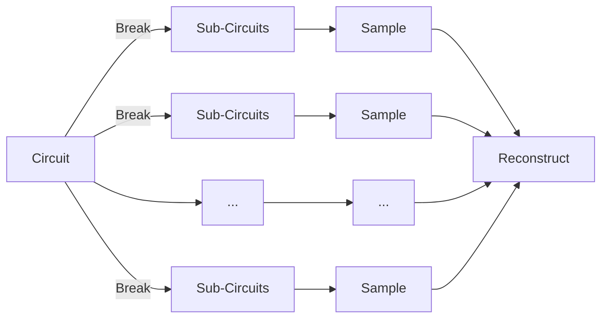

<section data-transition="fade-in none-out">

### Why Circuit Cutting?
Let us say we have the below circuit and it needs to be broken into smaller circuits. There are a few key reasons to do this

</section>
<section data-transition="none-in fade-out" style="overflow:hidden;">
<h2>Large Circuits are noisy</h2>
<iframe src="/embed/noise.html" style="width:100%;max-width:100%;max-height:100%;aspect-ratio:16/9;"
frameborder="0"></iframe>
</section><section data-transition="none-in fade-out">
<h2>It may require very few cuts to completely partition the circuit</h2>

</section><section data-transition="none-in fade-out">
<h2>We may not have a large enough quantum computer</h2>

<cite>[1]</cite>
</section>

===

<section data-transition="fade-in none-out">
<h2> Gate Cuts </h2>

</section>
<section data-transition="none-in fade-out">
<h2> Gate Cuts </h2>

</section>
<section data-transition="none-in fade-out">
<h2> Gate Cuts </h2>

</section>

===

<section data-transition="fade-in none-out">
<h2> Wire Cuts </h2>

</section>
<section data-transition="none-in fade-out">
<h2> Wire Cuts </h2>

</section>
<section data-transition="none-in fade-out">
<h2> Wire Cuts </h2>

</section>
<section data-transition="none-in fade-out">
<h2> Wire Cuts </h2>

</section>

===

### Quasi-Probability Sampling: If it ducks like a quack

<cite>[2]</cite>

We don't care about the gates. We only care about getting the same results. So we the following process

<!--
SPKNOTE:
WE USE Channel here since we don't know what the exact state is. It may be entangled with other states. So rather than on the state we just apply it to everything that passes in this tube

We also do this since some ops are non unitary (like mid-circuit measurements) which is exactly what we're doing here so in such a situation to fully describe the state of the Quantum Register we need to use a channel

-->

For any operator $U$ applied to channel $\rho$ let $S(U)\rho = U\rho U^\dagger,$ then

$$
S(U) = \sum_{j_1...j_n} \sum_{k_1...k_n} S(U)_{j,k} |e_{j_1}...e_{j_n}\rangle\rangle\langle\langle e_{k_1}...e_{k_n}|
$$

Then measurement is: Trace of the action of the Observable on the density matrix i.e $Tr(O S(U)\rho) = Tr(O U\rho U^\dagger)$

===

<section data-transition="fade-in none-out">

### Example Breakdown

$$
\begin{align}
S(e^{i\theta A_1\otimes A_2}) = cos^2\theta S(I\otimes I)+\sin^2\theta S(A_1\otimes A_2) + \frac{1}{8}\cos\theta\sin\theta\sum\alpha_1\alpha_2X(\alpha_i,A_i) \\
X(\alpha_i,A_i) = S((I+\alpha_1A_1)\otimes(I+i\alpha_2A_2))
+ S((I+i\alpha_1A_1)\otimes(I+\alpha_2A_2))
\end{align}
$$

### CZ Gate: $e^{-i\frac{\pi}{4} (I-Z_1)(I-Z_2)}$

</section><section data-transition="none-in fade-out">

### Example Breakdown

<cite>[3]</cite>

Running on observables: $[II, XX, YY, ZZ]$

  
Original Expectation

  
Reconstructed Expectations

We see despite different unitaries we get the same observable values  We have managed: space complexity &rarr; time complexity

Expected Unitary
$$
\begin{bmatrix}
1 & 0 & 0 & 0 \\
0 & 1 & 0 & 0 \\
0 & 0 & 1 & 0 \\
0 & 0 & 0 & -1 \\
\end{bmatrix}
$$

Actual Unitary
$$
\begin{bmatrix}
1-i & 0 & 0 & 0 \\
0 & 1+i & 0 & 0 \\
0 & 0 & 1+i & 0 \\
0 & 0 & 0 & -1-i \\
\end{bmatrix}
$$

</section>

===

## Open Questions

- How can we still get similar results without high overhead
- What is the best cut? Horizontal? Vertical? Hybrid?
- How well can we generalize this idea at scale

===

## Resources
- [1] ibm.com/quantum/roadmap
- Circuit Knitting Toolbox: *qiskit-extensions.github.io/circuit-knitting-toolbox*
- [2] [Mitarai & Fujii, *Constructing a virtual two-qubit gate by sampling single-qubit operations*](https://browse.arxiv.org/pdf/1909.07534.pdf)
- [3] CZ Expectation Replication: *pastebin.com/mY2AKBNp*

## Futher Reading

- Kosuke Mitarai, & Keisuke Fujii *Overhead for simulating a non-local channel with local channels by quasi-probability sampling*
- Lukas Brenner, Christophe Piveteau, & David Sutter. *Optimal wire cutting with classical communication*
Kristan Temme, Sergey Bravyi, & Jay M. Gambetta (2017). *Error Mitigation for Short-Depth Quantum Circuits*