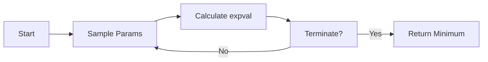

### Why Circuit Cutting?
Let us say we have the below circuit and it needs to be broken into smaller circuits. Before applying to larger circuits, we first try to break down a simple circuit

<figure>
    
    <figcaption>Hartree Fock Ansatz for H2</figcaption>
</figure>

We choose Hartree Fock for H2 since while simple, it's still a real world useful problem

===

### How will we cut it? Wire Cuts

<section data-transition="fade-in none-out">
    

    <figure>
        
        <figcaption>Uncut Circuit</figcaption>
    </figure>
    
&rarr;

    <figure>
        
        <figcaption>Move Gates Inserted</figcaption>
    </figure>
    

</section><section data-transition="none-in fade-out">
    

    <figure>
        
        <figcaption>Move Gates Inserted</figcaption>
    </figure>
    
&rarr;

    <figure>
        
        
        <figcaption>Wires cut</figcaption>
    </figure>
    

</section><section data-transition="none-in fade-out">
    

    <figure>
        
        <figcaption>Move Gates Inserted</figcaption>
    </figure>
    
&rarr;

    <figure>
        
        
        <figcaption>Wires cut</figcaption>
    </figure>
    

    

    Cutting is done via QPD sampling each circuit and comparing it to the original circuit. Gates are added to the cut circuits to make them equivalent to the original circuit. 

    This process is done as a sampling since circuits are variational and we want to find the best sum of circuits that is equivalent to the original circuit
    

</section>

===

### Applying to Hartree Fock of Hydrogen

<figure>
    
    <figcaption>subcircuit "A"</figcaption>
</figure>
<figure>
    
    <figcaption>subcircuit "B"</figcaption>
</figure>

while number of qubits in <i>cut</i> circuit &gt; qubits in <i>uncut</i> circuit,  as the circuit get larger this problem becomes negligible
   For Hydrogen: 4 qubits &rarr; 2+4 qubits while for Lithium: 20 qubits &rarr; 10+12 qubits

===

### Calculating Hamiltonian
Objective is to find parameters which can minimise the energy of the system. This is done by calculating the expectation value `expval` of the Hamiltonian.   
This expval is an upper bound on the ground state energy of the system
Objective is to find parameters which can minimise the energy of the system.   

  

||||
|:---:|--|:---|
| **Terminate When** |&emsp;| expval hasn't changed by &gt;0.5% in 10 samples |
| **Sample for Uncut** || Dual Annealing with BOBYBA |
| **Sample for Cut** || COBYLA |

===

### Results

<table>
<thead>
    <tr>
        <td colspan="1"></td>
        <td colspan="3">UnCut</td>
        <td colspan="3">Cut</td>
    <tr>
    <tr>
        <th>Classical (sto3g)</th>
        <th>Ideal</th>
        <th>No-mit</th>
        <th>MEM</th>
        <th>Ideal</th>
        <th>No-mit</th>
        <th>MEM</th>
    </tr>
</thead>
<tbody>
    <tr style="font: 100 0.8em monospace;">
        <td colspan="9">IBM: 4 qubit H₂</td>
    </tr>
    <tr>
        <td>-1.8426</td>
        <td>-</td>
        <td><b>-1.759</b></td>
        <td><b>-1.82</b></td>
        <td>-</td>
        <td>-1.7266</td>
        <td>-1.82</td>
    </tr>
    <!-- <tr>
        <td>Li₂</td>
        <td>20</td>
        <td>-16.366</td>
        <td>-</td>
        <td>-12.669</td>
        <td>-15.52</td>
        <td>-</td>
        <td>-15.786</td>
        <td>-16.348</td>
    </tr> -->
    <tr style="font: 100 0.8em monospace;">
        <td colspan="9">CQuICC: 4 qubit H₂</td>
    </tr>
    <tr>
        <td>-1.8426</td>
        <td>-1.8236</td>
        <td>-1.7541</td>
        <td>-1.7546</td>
        <td>-1.815</td>
        <td><b>-1.7915</b></td>
        <td><b>-1.834</b></td>
    </tr>
</tbody>
</table>

===

### Charts

<section data-transition="fade-in none-out">

<figure>
    
    <figcaption>UnCut Circuit</figcaption>
</figure>
<figure>
    
    <figcaption>Cut Circuit</figcaption>
</figure>

</section><section data-transition="none-in fade-out">

<figure>
    
    <figcaption>UnCut Circuit</figcaption>
</figure>
<figure>
    
    <figcaption>Ideal Simulator</figcaption>
</figure>

<figure>
    
    <figcaption>Noisy without mitigation</figcaption>
</figure>
<figure>
    
    <figcaption>Noisy MEM</figcaption>
</figure>

</section><section data-transition="none-in fade-out">

<figure>
    
    <figcaption>Cut Circuit</figcaption>
</figure>
<figure>
    
    <figcaption>Ideal Simulator</figcaption>
</figure>

<figure>
    
    <figcaption>Noisy without mitigation</figcaption>
</figure>
<figure>
    
    <figcaption>Noisy MEM</figcaption>
</figure>

</section>

===

## Next Steps

- Applying to Li2, CH4
- Getting a small pipeline so that arbitrary circuits can be cut
- Experimentation with Binary Search Cutting (Ref: FracQC)