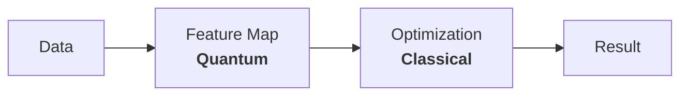
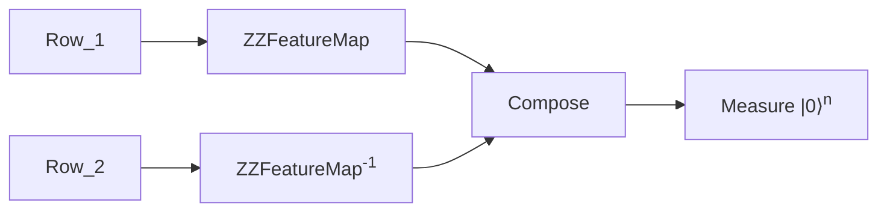

===

## Dataset
LTI has provided us with a dataset of 200 rows with the following structure where `y` is the binary variable we want to predict
with the rest being the features


- $y \in \{0,1\}$ binary var about engine condition
- $x_i \in [-1,1]$ 6 features of the engine for $i \in$ \
 [ `Coolant Temp, Fuel Pressure, RPM, Oil Pressure, Coolant Pressure, Oil Temp` ]

This is a table of 7 columns and 200 rows. The function we ran for them is as follows
```ts
sampler = Sampler()

kernel = FidelityQuantumKernel(
  fidelity=ComputeUncompute()
  feature_map=ZZFeatureMap(6)
)
qsvc = QSVC(quantum_kernel=kernel)
qsvc.fit(Xtrain, ytrain)
```

The core of the entire algorithm is `qsvc.fit`; we will not go ahead and see how it works in order to be then able to optimize it.

## Overview
Unlike other algorithms, Qiskit QSVM does not operate in tandem[@1]
with classical computers. It first runs purely on a
quantum computer and then uses a classical computer
to do the optimization and classification

## SVM Overview
The general idea of an SVM is to have data points from which we can draw a line (hyperplane) +++through and classify them into two classes. The SVM algorithm then finds the best possible hyperplane that separates the data into two classes.[@2]

<svg src="Wikimedia Commons" alt="Drawing a line between 2 classes" stroke="none" stroke-linecap="round" stroke-linejoin="round" viewbox="0 0 232 166" height="139" width="200">
<g transform="translate(-212 -169)">
<rect width="205.4" height="51.1" x="194" y="258" fill="#07f3" color="#000" rx="2.2" ry="2.3" transform="rotate(-6)"></rect>
<path fill="none" stroke="#000" d="M216 317h226"></path>
<path d="m431 313 12 4-12 5c2-3 2-6 0-9z"></path>
<path fill="none" stroke="#000" d="M216 317V173"></path>
<path d="m212 183 4-12 5 12c-3-2-7-2-9 0z"></path><text x="230" y="177" font-size="15"><tspan x="230" y="177">y</tspan><tspan x="436" y="336">x</tspan></text>
<g fill="#3139ae"><path d="M345 273a4 4 0 1 1-7-2 4 4 0 0 1 7 2z"></path><path d="M308 298a4 4 0 1 1-8 0 4 4 0 0 1 8 0z"></path><path d="M303 278a4 4 0 1 1-8-2 4 4 0 0 1 8 2z"></path><path d="M369 287a4 4 0 1 1-8 0 4 4 0 0 1 8 0z"></path><path d="M337 296a4 4 0 1 1-8 0 4 4 0 0 1 8 0z"></path><path d="M327 284a4 4 0 1 1-9 0 4 4 0 0 1 9 0z"></path><path d="M360 304a4 4 0 1 1-8 0 4 4 0 0 1 8 0z"></path><path d="M387 305a4 4 0 1 1-8 0 4 4 0 0 1 8 0z"></path><path d="M387 275a4 4 0 1 1-8 0 4 4 0 0 1 8 0z"></path></g>
<g fill="#dd2a2b"><path d="M296 193h7v7h-7v-7z"></path><path d="M324 219h7v7h-7v-7z"></path><path d="M317 188h7v7h-7v-7z"></path><path d="M295 210h6v7h-6v-7z"></path><path d="M273 192h7v7h-7v-7z"></path><path d="m264 226 7-1v7h-7v-6z"></path><path d="M250 209h7v7h-7v-7z"></path><path d="M342 191h7v7h-7v-7z"></path>
</g>
  <path fill="none" stroke="#0034ff" stroke-width="2" d="m225 260 204-23"></path><text x="431" y="242" fill="#00f">A</text><text x="382" y="182" fill="#00f">B</text>
    </g>
</svg>

Often finding a hyperplane is not possible in the original
feature space, so we use a feature map to map the data
to a higher dimensional space where it is possible to
find a hyperplane


This feature map is a function $\phi$ , which is difficult to find
classically. This is where the quantum computer comes in
to find a better feature map. A feature map is a function
which effectively lets us find the distance between two
points in a higher-dimensional space.

# QSVM
We can see from the above it may make sense
to generate the kernel matrix in a Quantum

/===
===

Computer to take advantage of its ability to find
better feature spaces to generate a Kernel Matrix
and then use a classical computer to do the
optimization and classification




---
|**Algorithm 1**: QSVM Internals [@1]
---
```psd
**for** row x in $[0, N]$ rows
 **for** row y in $y > x$
  calculate $|\langle K(x)|K(y)\rangle|^2$
```
---

And to calculate each of these values we run the following circuit of 6 qubits but 12 parameters $[x_1, x_2, \dots, x_6, y_1, y_2, \dots, y_6]$

---
|**Algorithm 2**: $|\langle K(x)|K(y)\rangle|^2$
---
```psd
**for** feature $x_i$ in $[0,6]$ from $x$
 init value $x_i$
 apply $H$
done
run $\text{ZZFeatureMap}( x_i )$

**for** feature $y_i$ in $[0,6]$ from $y$
 init value $y_i$
 apply $H$
done
run $\text{ZZFeatureMap}^T( y_i )$

return measurement
```
---


## Quantum Part
To find the distance between any two points at a time,
we run them through a circuit. This circuit **is** the feature map and exists in Hilbert Space.

Therefore for each pair of row, we take all points and encode them in a quantum circuit as


+++
<br/>
T</sup>" url="Higgs analysis with quantum classifiers, Belis et. al."/>

$ZZFeatureMap$ is the feature map + entanglement. We do this for ${}^N C_2$ pairs of rows to calculate the Kernel Matrix
, which will be of the form $|\langle K(x)|K(y)\rangle|^2 = K_{x,y}$ and will be later used for gradient descent to find the optimum coefficients and bias values for the SVM. The kernel matrix tends to look as follows[@3]

$$
\begin{bmatrix}
  k_{1,1} & k_{1,2} & \dots & k_{1,N} \\
  k_{2,1} & k_{2,2} & \dots & k_{2,N} \\
  \vdots & \vdots & \ddots & \vdots \\
  k_{N,1} & k_{N,2} & \dots & k_{N,N} \\
\end{bmatrix}
$$

here [@3]

$$
k(x_{i},x_{j})=|\langle\Phi(x_{i})|\Phi(x_{j})\rangle|^{2}=|\langle 0^{n}|U^{\dagger}(x_{i})U(x_{j})|0^{n}\rangle|^{2}
$$

Where ZZFeatureMap involves entanglement between qubits along with single-qubit operations, the number of qubits required is the same as the number of features. For a vector $x_i$ with m features $x_i=\{x_i^{(1)},\dots,x_i^{(m)}\}$

$$
U=\widetilde{U}_{\Phi(x)}H^{\otimes m}
$$

and

$$
\widetilde{U}_{\Phi(x)} = \text{exp} \left(j\sum_{k\in [m]}\phi_k(x_i)\prod_{l\in k}Z_l\right)
$$

where $\phi_{(p,q)}(x_i)=(\pi- x_i^{(p)})(\pi-x_i^{(q)})$ and $\phi_p(x_i) = x_i^{(p)}$

We will also repeat this step during prediction to get the test data to the same feature space as the training data.

This step is the dominant factor in the runtime complexity $O(N^2),$ since the kernel matrix is $N\times N.$ So for $N=200$ rows we run the Quantum Circuit $N^2 = 4\times 10^4$ times ASSUMING 1 SHOT ACCURACY


/===
===

### Classical Part
This is a fairly standard part which has been
optimised over the years to be very fast
given the Kernel Matrix. Simple gradient descent for the coefficients of each row in the Kernel Matrix to calculate the coefficients and bias for the Decision Function[@2]

$$f(x) = \text{sign }(∑(α_i y_i K(x_i, x) + b))$$
where

- $α_i$ is the coefficient
- $b$ is the bias
and
- $K(x_i, x)$ is the kernel function
- $y_i$ is the label (from the test set)

The gradient descent is made subject to the constraints

minimum: $\frac{1}{2} \times ∑ ∑ (α_i α_j y_i y_j K(x_i, x_j)) - ∑ α_i$ \
subject to: $∑ α_i y_i = 0$ \
&emsp;&emsp;&emsp;&emsp; $0 \le α_i \le C$ for all $i$

### Recap
- We have a dataset of 200 rows with six features and one label
- We run the Quantum Circuit $200\times 200 = 4\times 10^4$ times to generate the Kernel Matrix
- We use the Kernel Matrix to find the coefficients and bias for the Decision Function
- We use the Decision Function to predict the labels for the test set

We now optimise for the following
- the number of Circuits run
- the amount of time EACH Quantum Circuit takes

## Optimizations
Most of these optimisations are only possible assuming we manually rewrite the QSVM manually.

### Rounding (Classical)
Consider a sample row from the dataset
+++
```json
[
  -0.0863255013760815,
  ...
  0.03479271773272299
]
```

We can see here how data is precise to 16 digits despite the fact that temperature and pressure are smoothly varying units &rarr; there exists a precision beyond which information is redundant.

It would make much more sense to find what this point is and then round to that precision to save time and space. Lower Precision has 2 benefits
- Lower memory to store data => io is faster
- Better parallelisation since 4 fp16 calculations can be run on 1 fp64 register
- Higher collision rate with the memoization table

Ex. $[ -0.0863,..., 0.0348 ]$

### Memoization (Both)
Internally Qiskit does not memoize the circuit parameters and their values. This means that running the same parameters $n$ times will be executed on actual hardware $n$ times. This is a huge waste of time and resources. We can memoize the parameters and their values to avoid doing so

Memoisation also acts as a sanity check since, for a well-shuffled dataset, the collision rate should be low.

### Parallelization (Quantum)
#### Internal Parallelization
Currently, we use 1 single 6 Qubit ZZFeatureMap. This causes a high depth slowing down the Quantum Layer. A better attempt is the following the 6-ZZFeatureMap made up of 2-ZZFeatureMaps to reduce the depth

This circuit has just a depth of $10$ but still has entanglement between all Qubits. This slightly decouples the feature space, but it might be a worthwhile tradeoff to make the circuit faster since it is now effectively $1/{5^{th}}$ the depth it was before

/===
===


#### External Parallelization
We can also parallelize the Quantum Circuit by running multiple Quantum Circuits in parallel. This is possible since the Quantum Circuits are independent of each other and can be run in parallel on larger machines.

So for a 27 qubit machine, we can run 4 circuits in parallel and then push the results of all to get the Kernel Matrix. This will reduce the number of times we run the Quantum Computer by a factor of 4

```text
Ex. ibmq_kolkata @ 27 Qubits
6 Qubits x4 in Parallel
     ┌─────────┐
q_0: ┤         │  ┌─┐
...  │Circuit 1├──┤M├
q_5: ┤         │  └╥┘
     └─────────┘   ║
 ⋮       ⋮     ⋮    ⋮    ⋮
     ┌─────────┐   ║
q_18:┤         │   ║  ║    ┌─┐
...  │Circuit 4├───╫──╫──╫─┤M├
q_23:┤         │   ║  ║  ║ └╥┘
     └─────────┘   ║  ║  ║  ║
q_24:──────────────╫──╫──╫──╫
q_25:──────────────╫──╫──╫──╫
q_26:──────────────╫──╫──╫──╫
 c_n:24/═══════════╩══╩══╩══╩
                   6  12 18 24
```

### Simulations
It's worth using a NoiseModel simulator to see how the results are approximately before running it on a Quantum Computer.
+++

### Alternate Approaches
#### QUBO
The current approach is to do a Quantum Feature Map and then classical optimisation. It is also worth approaching the problem where a different angle, where we use a classical feature map and then convert that to a QUBO to anneal it.

## Bibliography
[1. Qiskit contributors. (2023). "Qiskit: An Open-source Framework for Quantum Computing"](#ref)
[2. Cortes, C., Vapnik, V. "Support-vector networks". *Mach Learn* 20, 273–297 (1995)](#ref)
[3. Bang-Shien Chen, & Jann-Long Chern. (2022). "Generating quantum feature maps for SVM classifier"](#ref)

/===