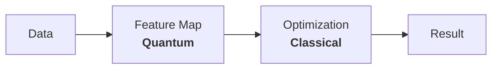
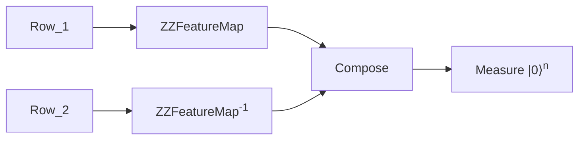

===

## Dataset
LTI has provided us with a dataset of 200 rows with the following structure where `y` is the binary variable we want to predict
with the rest being the features[@1]

- $y \in \{0,1\}$ binary var about engine condition
- $x_i \in [-1,1]$ 6 features of the engine for $i \in$ [`Coolant Temp, Fuel Pressure, RPM, Oil Pressure, Coolant Pressure, Oil Temp`]

This is a table of 7 columns and 200 rows The function we ran for them is as follows
```py
sampler = Sampler()

quantum_kernel = FidelityQuantumKer
  fidelity=ComputeUncompute(sampler
  feature_map=ZZFeatureMap(6, entan
)
qsvc = QSVC(quantum_kernel=quantum_
qsvc.fit(Xtrain, ytrain)
```

The core of the entire algorithm is `qsvc.fit`, we will not go ahead and see how it works, in order to then be able to optimize it

## Overview
Unlike other algorithms, QSVM does not operate in tandem
with a classical computers. It first runs purely on a
quantum computer and then uses a classical computer
to do the optimization and classification

## SVM Overview
The general idea of an SVM is to have data points which we can draw a line (hyperplane) through and+++classify them into two classes. The SVM algorithm then finds the best possible hyperplane that separates the data into two classes.

<svg xmlns="http://www.w3.org/2000/svg" stroke="none" stroke-linecap="round" stroke-linejoin="round" viewBox="0 0 232 166" height="139" width="200"><g transform="translate(-212 -169)"><rect width="205.4" height="51.1" x="194" y="258" fill="#07f3" color="#000" rx="2.2" ry="2.3" transform="rotate(-6)"/><path fill="none" stroke="#000" d="M216 317h226"/><path d="m431 313 12 4-12 5c2-3 2-6 0-9z"/><path fill="none" stroke="#000" d="M216 317V173"/><path d="m212 183 4-12 5 12c-3-2-7-2-9 0z"/><text x="230" y="177" font-size="15"><tspan x="230" y="177">y</tspan><tspan x="436" y="336">x</tspan></text><g fill="#3139ae"><path d="M345 273a4 4 0 1 1-7-2 4 4 0 0 1 7 2z"/><path d="M308 298a4 4 0 1 1-8 0 4 4 0 0 1 8 0z"/><path d="M303 278a4 4 0 1 1-8-2 4 4 0 0 1 8 2z"/><path d="M369 287a4 4 0 1 1-8 0 4 4 0 0 1 8 0z"/><path d="M337 296a4 4 0 1 1-8 0 4 4 0 0 1 8 0z"/><path d="M327 284a4 4 0 1 1-9 0 4 4 0 0 1 9 0z"/><path d="M360 304a4 4 0 1 1-8 0 4 4 0 0 1 8 0z"/><path d="M387 305a4 4 0 1 1-8 0 4 4 0 0 1 8 0z"/><path d="M387 275a4 4 0 1 1-8 0 4 4 0 0 1 8 0z"/></g><g fill="#dd2a2b"><path d="M296 193h7v7h-7v-7z"/><path d="M324 219h7v7h-7v-7z"/><path d="M317 188h7v7h-7v-7z"/><path d="M295 210h6v7h-6v-7z"/><path d="M273 192h7v7h-7v-7z"/><path d="m264 226 7-1v7h-7v-6z"/><path d="M250 209h7v7h-7v-7z"/><path d="M342 191h7v7h-7v-7z"/></g><path fill="none" stroke="#0034ff" stroke-width="2" d="m225 260 204-23"/><text x="431" y="242" fill="#00f">A</text><text x="382" y="182" fill="#00f">B</text></g></svg>

Often finding a hyperplane is not possible in the original
feature space,so we use a feature map to map the data
to a higher dimensional space where it is possible to
find a hyperplane


This feature map is a function $φ$ which is difficult to find
classically. This is where the quantum computer comes in
to find a better feature map. A feature map is a function
which effectively lets us find the distance between two
points in a higher dimensional space

# QSVM
We can see from the above it may make sense
to generate the kernel matrix in a Quantum
Computer to take advantage of its ability to find
better feature spaces to generate a Kernel Matrix
and then use a classical computer to do the
optimization and classification

/===
===



## Quantum Part
We do not need the predictions at this stage

In order to find the distance between any two points
we need to take each of those points two at a time and
run them through a circuit. This circuit **is** the feature
map and exists in the Hilbert Space.

Therefore for each pair of row we take all points and encode them in a quantum circuit as




$ZZFeatureMap$ is the feature map + entanglement. We do this for ${}^N C_2$ pairs of rows to calculate the Kernel Matrix
which will be of the form $|\langle K(x)|K(y)\rangle|^2 = K_{x,y}$ and will be later used for gradient descent to find the optimum coefficients and bias values for the SVM

We will also repeat this step during prediction to get the test data to the same feature space as the training data

Note: This step is the most computationally expensive
and the dominant factor in the runtime complexity of
the algorithm. $O(N^2)$ since the size of the kernel
matrix is $N\times N$ where $N$ is the number of rows. For a
dataset of 200 we run the Quantum Circuit $200\times 200 = 4\times 10^4$ times ASSUMING 1 SHOT ACCURACY

### Classical Part
This is a fairly standard part which has been
optimised over the years to be very fast
given the Kernel Matrix

Simple gradient descent for the coefficients
of each row in the Kernel Matrix to calculate the
+++coefficients and bias for the Decision Function

$f(x) = sign(∑(α_i y_i K(x_i, x) + b))$

where
- $α_i$ is the coefficient
- $b$ is the bias
and
- $K(x_i, x)$ is the kernel function
- $y_i$ is the label (from test set)

the gradient descent is done subject to the constraints

minimum: $\frac{1}{2} \times ∑ ∑ (α_i α_j y_i y_j K(x_i, x_j)) - ∑ α_i$ \
subject to: $∑ α_i y_i = 0$ \
&emsp;&emsp;&emsp;&emsp; $0 \le α_i \le C$ for all $i$

### Recap
- We have a dataset of 200 rows with 6 features and 1 label
- We run the Quantum Circuit $200\times 200 = 4\times 10^4$ times to generate the Kernel Matrix
- We use the Kernel Matrix to find the coefficients and bias for the Decision Function
- We use the Decision Function to predict the labels for the test set

The problem now is that the function is taking too long and is not optimised at all. We need to find a way to reduce
- the number of times we run the Quantum Circuit
- the amount of time EACH Quantum Circuit takes

## Optimizations
The following solutions will all work only under the assumption that we're rewriting the QSVM fucntion from scratch for our use case

The predefined QSVM function will not let us do most of these

### Rounding (Classical)
For demonstration purposes below is one row of the features from the dataset

/===
===

```json
[
  -0.0863255013760815,
  -0.0622786646153247,
  -0.3165006166853443,
  -0.24428658380998922,
	0.517764710501253,
  0.03479271773272299
]
```

We can see here how data is precise to 16 digits despite the fact that temperature and pressure are smoothly varying units &rarr; there exists a precision beyond which information is redundant

It would make much more sense to find what this point is then round to that precision to save time and space. Lower Precision has 2 benefits
- Lower memory to store data
- Better parallelisation since 4 fp16 calculations can be run on 1 fp64 register
- Higher collision rate with the memoization table

Ex.
```json
[
  -0.0863, -0.0623,
  -0.3165, -0.2443,
  0.5177, 0.0348,
]
```

### Memoization (Both)
Internally Qiskit does not memoize the circuit parameters and their values. This means that if we run the same parameters $n$ times it will be executed on actual hardware $n$ times. This is a huge waste of time and resources. We can memoize the parameters and their values to avoid doing so

Memoisation also acts as a basic sanity check since for a well shuffled dataset the collision rate should be low

### Parallelization (Quantum)
#### Internal Parallelization
Currently the model uses 1 single 6 Qubit ZZFeatureMap. This causes a significant depth slowing down the Quantum Layer. To start with the following is the effective diagram of a 6-ZZFeatureMap made up of 2-ZZFeatureMaps both +++with full entanglement.

This circuit has just a depth of $10$ but still has entanglement between all Qubits. This slightly decouples the feature space but it might be a worthwhile tradeoff to make the circuit faster since it is now effectively $1/{5^{th}}$ the depth it was before


#### External Parallelization
We can also parallelize the Quantum Circuit by running multiple Quantum Circuits in parallel. This is possible since the Quantum Circuits are independent of each other and can be run in parallel on larger machines

So for a 27 qubit machine, we can run 4 circuits in parallel and then push the results of all to get the Kernel Matrix. This will reduce the number of times we run the Quantum Computer by a factor of 4

### Simulations
It is worth using a NoiseModel based simulator to see how close the results are to the Quantum Computer for small datasets. This will give us data on what the final results are expected to look like.


### Alternate Approaches
#### QUBO
The current approach is to do a Quantum Feature Map and then classical optimisation. It is also worth approaching the problem where a different angle where we use a classical feature map and then convert that to a QUBO to anneal it

/===

[#1]: Testing ref