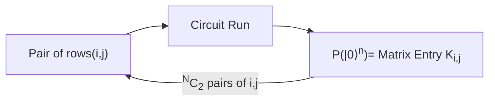

===

## Dataset
LTI has provided us with a dataset of 200 rows with the following structure where `y` is the binary variable we want to predict
with the rest being the features

- $y \in \{0,1\}$ binary var about engine condition
- $x_i \in [-1,1]$ 6 features of the engine for $i \in$ [`Coolant Temp, Fuel Pressure, RPM, Oil Pressure, Coolant Pressure, Oil Temp`]

This is a table of 7 columns and 200 rows

## Overview
Unlike other algorithms, QSVM does not operate in tandem
with a classical computers. It first runs purely on a
quantum computer and then uses a classical computer
to do the optimization and classification

## SVM Overview
The general idea of an SVM is to have data points which we can draw a line (hyperplane) through and classify them into two classes. The SVM algorithm then finds the best possible hyperplane that separates the data into two classes.

<svg xmlns="http://www.w3.org/2000/svg" stroke="none" stroke-linecap="round" stroke-linejoin="round" viewBox="0 0 232 166" height="139" width="200"><g transform="translate(-212 -169)"><rect width="205.4" height="51.1" x="194" y="258" fill="#07f3" color="#000" rx="2.2" ry="2.3" transform="rotate(-6)"/><path fill="none" stroke="#000" d="M216 317h226"/><path d="m431 313 12 4-12 5c2-3 2-6 0-9z"/><path fill="none" stroke="#000" d="M216 317V173"/><path d="m212 183 4-12 5 12c-3-2-7-2-9 0z"/><text x="230" y="177" font-size="15"><tspan x="230" y="177">y</tspan><tspan x="436" y="336">x</tspan></text><g fill="#3139ae"><path d="M345 273a4 4 0 1 1-7-2 4 4 0 0 1 7 2z"/><path d="M308 298a4 4 0 1 1-8 0 4 4 0 0 1 8 0z"/><path d="M303 278a4 4 0 1 1-8-2 4 4 0 0 1 8 2z"/><path d="M369 287a4 4 0 1 1-8 0 4 4 0 0 1 8 0z"/><path d="M337 296a4 4 0 1 1-8 0 4 4 0 0 1 8 0z"/><path d="M327 284a4 4 0 1 1-9 0 4 4 0 0 1 9 0z"/><path d="M360 304a4 4 0 1 1-8 0 4 4 0 0 1 8 0z"/><path d="M387 305a4 4 0 1 1-8 0 4 4 0 0 1 8 0z"/><path d="M387 275a4 4 0 1 1-8 0 4 4 0 0 1 8 0z"/></g><g fill="#dd2a2b"><path d="M296 193h7v7h-7v-7z"/><path d="M324 219h7v7h-7v-7z"/><path d="M317 188h7v7h-7v-7z"/><path d="M295 210h6v7h-6v-7z"/><path d="M273 192h7v7h-7v-7z"/><path d="m264 226 7-1v7h-7v-6z"/><path d="M250 209h7v7h-7v-7z"/><path d="M342 191h7v7h-7v-7z"/></g><path fill="none" stroke="#0034ff" stroke-width="2" d="m225 260 204-23"/><text x="431" y="242" fill="#00f">A</text><text x="382" y="182" fill="#00f">B</text></g></svg>

Often finding a hyperplane is not possible in the original
feature space,so we use a feature+++map to map the data
to a higher dimensional space where it is possible to
find a hyperplane

This feature map is a function $φ$ which is difficult to find
classically. This is where the quantum computer comes in
to find a better feature map. A feature map is a function
which effectively lets us find the distance between two
points in a higher dimensional space

# QSVM
We can see from the above it may make sense
to generate the kernel matrix in a Quantum
Computer to take advantage of its ability to find
better feature spaces to generate a Kernel Matrix
and then use a classical computer to do the
optimization and classification

## Quantum Part
*We do not need the predictions at this stage*

In order to find the distance between any two points
we need to take each of those points two at a time and
run them through a circuit. This circuit **is** the feature
map and exists in the Hilbert Space.

/===
===

Therefore for each row we take all points and encode them in
a quantum circuit as

/===

The scaling is as follows
- Number of rows &rarr; Dimension of the feature space \
  i.e 200 rows will give a 200x200 Kernel Matrix
- Number of columns &rarr; Number of features \
  i.e 6 columns will need 6 qubits

### Quantum Part
Here each qubit in a circuit is a feature

+++

- For each ${}^N C_2$ pairs of rows we run a circuit
with N(100 shots) to calculate the Kernel Matrix
of the form $|\langle K(x)|K(y)\rangle|^2 = K_{x,y}$
- K is decided by the circuit gates used in the SVM
in the feature map, in our case $U(x)$ `ZZFeatureMap`
followed by a trainable $r(\theta)$ `RX` gate
- Note: We have no use of the predictions at this
stage, we just need the features and their values

This means they run the above circuit
$200*200*100 = 4*10^6$ times as is.

This step is where the inefficiency lies

### Classical Part
Simple gradient descent for the coefficients
of each row in the Kernel Matrix

we use the following formula to calculate the
actual function
$f(x) = sign(∑(α_i y_i K(x_i, x) + b))$
where $α_i$ is the coefficient of the $i^{th}$ row

minimize: $\frac{1}{2} * ∑ ∑ (α_i α_j y_i y_j K(x_i, x_j)) - ∑ α_i$ \
subject to: $∑ α_i y_i = 0$
            $0 <= α_i <= C$ for all $i$

this minimisation is done using simple gradient descent

This function then finally calculates the optimum
coefficients and bias and stores it in the QSVC
instance. To make predictions we can just call
`predict` on the QSVC instance

/===