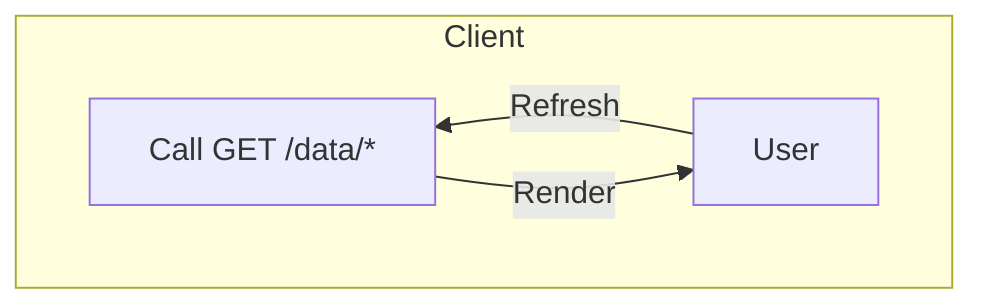
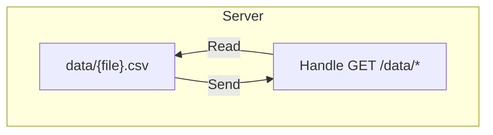
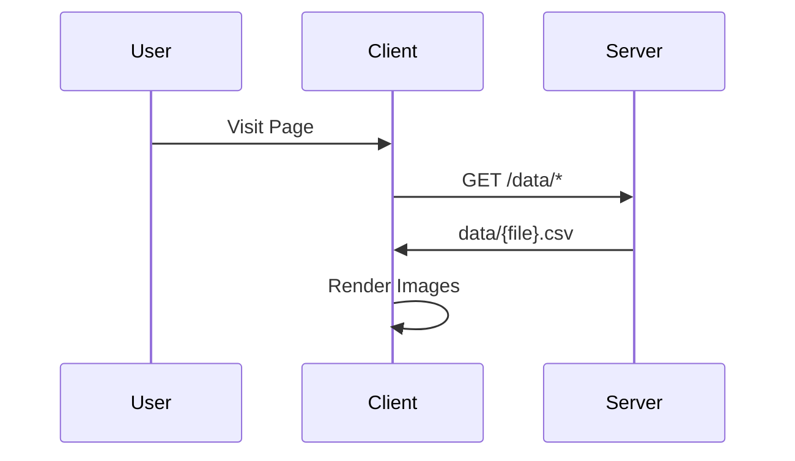
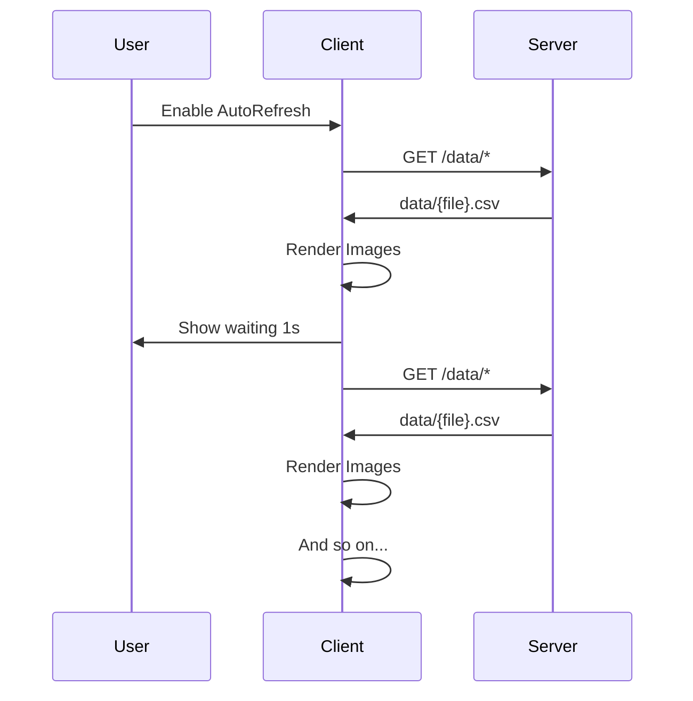

<!-- https://www.industrialempathy.com/posts/design-docs-at-google/ -->
===

The following is a design document for the Redpitaya Webserver. It is a work in progress and will be updated as the project progresses.

## Context & Scope
The Webserver is a web application that allows users to plot to current state of Convergence of spin states

## Goals
User will be able to
- Refresh Manually or Automatically
- Set Refresh Rate (if Auto Refresh)
- Enter `N` (for NxN)
- Kill Process and/or Server

System will be able to
- AutoRefresh if enabled at a provided rate
- Get $N\times N$ from `spingrid.csv` and plot a heatmap
- Get $k$ rows of $(x,y)$ from `convergence.csv` and plot a loss plot

Paramters
```ts
type RefreshRate = number // sec
// default: 1
type N = number // NxN
// default: 50
type AutoRefresh = boolean
// default: true
```

## Design
Architecture & Data Flow for the application, treating frontend & backend separately
+++
### Architecture
When refresh is triggered (manually or else), the client sends a GET to the server, and renders the data as images

The server listenss for GET requests and responds with the requested data from the `data/` directory


### Directory Structure
The following is the directory structure on the board. The program will serve `*.csv` data from the `/webapp/server/data/` dir to the client
```
/webapp/server/
  ├── assets/
  │  ├─ *.css, *.js
  │  ├─ vendors/ (dependencies)
  │  ├── bars.svg (loading spinner)
  │  └── update.sh (update server)
  ├─ data/ (MAIN DATA)
  │  ├── sendgrid.csv
  │  └── convergence.csv
  ├─ demo.py
  ├─ index.html
  ├─ main.sh (runner script)
  └── server/
      ├── *.go files
      └── red (executable)
```
/===
===

### APIs
The following are the APIs that the server will expose to the client
```yaml
# Ok is when request is 200
# Err is when 40x or 50x
# Only GET is supported
"/" : "index.html",
"/data/{file}" : {
  // get file from server
  ok: "data/{file}.csv",
  err: 404
},
"/assets/{file}" : {
  // get file from server
  ok: "(server) /assets/{file}",
  err: 404
},
"/kill/parent": {
  // kill parent webserver
  ok: null,
  err: 500, text() /* forwarded */
},
"/kill/child": {
  // kill all child processes
  ok: "He was taken from us too soon",
  err: "Couldn't kill proc:"+text()
},
"*": 404
# Note:
# all server err will be forwarded
# to the client as text as is
```

### Sample User Flow
1. User visits the page (AutoRefresh `off`)

+++
2. User enables AutoRefresh


### Interface
User must have the following interactions

<style>
  .btn{
    padding: 10px;
    border-radius: 5px;
    background: #aaf;
    margin: 5px;
  }
  .disp{
    background: #ccc;
    padding: 2px 5px;
    border-radius: 2px;
  }
  input[type="number"]{
    border-radius: 2px;
    border: 1px solid #888;
  }
</style>

- Refresh Button <button class="btn">Refresh<button>

This button calls refresh regardless of AutoRefresh's state.
if AutoRefresh is on, we will force a refresh and reset the timer
if AutoRefresh is off, we will just refresh once

- AutoRefresh Toggle: toggles AutoRefresh on/off along with the refresh rate

<div class="disp f j-bw">
  Rate(s): <input type="number" value="1">
  AutoRefresh: <input type="checkbox" checked>
</div>

- N Input
This input allows the user to set the value of N

<div class="disp">
  <span> N: <input type="number" value="50"></span>
</div>

- Kill Buttons: allow the user to kill the server and/or the process

<div class="disp">
  <button class="btn">Kill Server</button>
  <button class="btn">Kill Process</button>
</div>

/===
===

## Rendered Images

### Heatmap
The following is an example of a 50x50 heatmap which should be expected from data and updated every second


The data for this is expected to be of the form
```csv
1,0,0...N...0,1
0,0,1...N...1,0
.
. N rows
.
0,1,0...N...0,0
```

This will be a matrix of $N\times N$ with binary values and we expect it to keep updating in the background (with unknown frequency). We will keep fetching and displaying whatever comes & show it to the user at the set frequency. We will rerender the data weather or not it has changed on the given frequency.

### Loss Plot
The following is an example of a loss plot which should be expected from data and updated every second
+++


The data for this is expected to be of the form with k rows of $(x,y)$
```csv
0,10.0
1,9.25
2,8.94
3,8.7
4,8.5
...
```

This data is passed on to an external library `Chart.js` and we let them render it since it happens efficiently. Under the hood it does the following in case of a scatter plot

/===