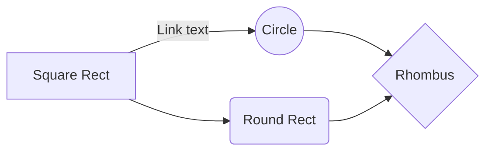

===

## Usage Guide
### Images & Citations


Even for SVG
<svg width="100" height="100" alt="Something like this" url="wikipedia.org">
  <circle cx="50" cy="50" r="40" stroke="green" stroke-width="4" fill="yellow" />
</svg>

```js
function t(code){
  return "is supported";
};
console.log(100 + t("js"));

const withFull = (syntax) => "hl";
// additionally
// text, mermaid, psd (pseudocode)
```
+++

Too much UMLing is bad for health. But anyway this supports markdown and Katex inside pseudo code.

---
|**Algorithm 1**: QSVM Internals
---
```psd
**for** row x in $[0, N]$ rows
 **for** row y in $y > x$
  calculate $|\langle K(x)|K(y)\rangle|^2$
```
---

Math is also $ \frac{1}{2} $ supported.

$$
\begin{bmatrix}
1 & 2 & 3 \\
4 & 5 & 6 \\
7 & 8 & 9
\end{bmatrix}
$$

A lot of math, in fact. All of Katex

$$
\begin{aligned}
\dot{x} & = \sigma(y-x) \\
\dot{y} & = \rho x - y - xz \\
\dot{z} & = -\beta z + xy
\end{aligned}
$$

### Tables
| Some | Table | Here  |
|------|-------|-------|
|$4^2$ | and 7 years ago| 3     |
| 2    | 3     | 4     |

### Lists & Citations
- [x] This is a task list
- [ ] This is another task [list](https://en.wikipedia.org/wiki/Task_list)
- [ ] This is a task list [@1]



/===
===

```text
// ASCII art is also supported
     ┌─────────┐
q_0: ┤         │  ┌─┐
...  │Circuit 1├──┤M├
q_5: ┤         │  └╥┘
     └─────────┘   ║
 ⋮       ⋮     ⋮    ⋮    ⋮
     ┌─────────┐   ║
q_18:┤         │   ║  ║    ┌─┐
...  │Circuit 4├───╫──╫──╫─┤M├
q_23:┤         │   ║  ║  ║ └╥┘
     └─────────┘   ║  ║  ║  ║
q_24:──────────────╫──╫──╫──╫
q_25:──────────────╫──╫──╫──╫
q_26:──────────────╫──╫──╫──╫
 c_n:24/═══════════╩══╩══╩══╩
                   6  12 18 24
```


<style>
  button{
    background: red;
    color: white;
    border: none;
    border-radius: 5px;
    padding: 5px;
  }
</style>
<div>
Full HTML <button>is</button> supported. that means
css also
</div>

You'll be alerted if you forget to cite an image.


## Bibliography
[1. Thats shit up there. (2023). "Is cited here"](#ref)

+++/===