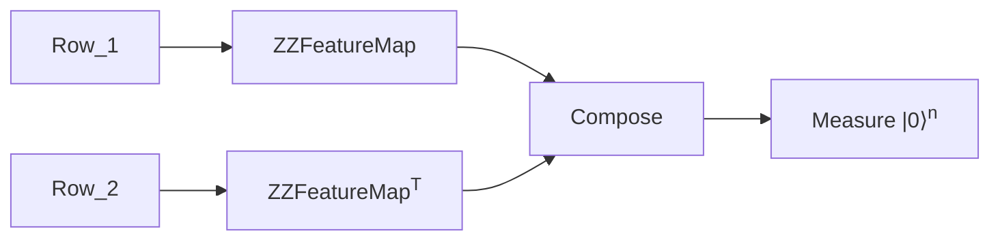

### Received Dataset

|Coolant T|Fuel P|LOG(Engine rpm)|LOG(Lub oil P)|LOG(Coolant P)|lub oil T|Engine Condition|
|---|---|---|---|---|---|---|
|-0.7727|0.3442|0.4828|-0.2438|0.2430|0.5634|**1**|
|...|...|...|...|...|...|...|
|...|...|...|1200 rows|...|...|
|...|...|...|...|...|...|...|
|-0.0863|-0.0622|-0.3165|-0.2442|0.5177|0.0347|**0**|
===

### Objectives
- Classify engine condition
- Use SVM for classification
- Compare QSVM with classical SVM

 

Kernel Machine

===

We want a more accurate curvy line for which we need to transform the feature space. This is where the kernel trick comes in.

  

- Go to a higher dimension
- Find a linear separator
- Project back to original space

More mathematically
- Find a feature map $\phi$ such that $\phi(x_i) \cdot \phi(x_j) = K(x_i, x_j)$
- Generate a kernel matrix $K$ such that $K_{ij} = K(x_i, x_j)$
- Find all support vectors i.e $\alpha_i \because \sum \alpha_i y_i = 0$
- Find the bias $b$ such that $y_i(\sum \alpha_i y_i K(x_i, x_j) + b) = 1$
- We can now predict $Y_{OUT} = \text{sign}(\sum \alpha_i y_i K(X_{IN}, x_j) + b)$

<iframe height="200" style="width: 100%;" data-show-tab-bar='no' scrolling="no" title="3D Scatter Plot with Plotly.js Charts" src="/embed/scatter.html" frameborder="no" loading="lazy" allowtransparency="true" allowfullscreen="true">
</iframe>

===

## Two Approaches

<h3>Quantum Precomputed + Classical SGD</h3>

⚛ Quantum precomputed kernel  
↓  
💻 Classical SGD

**Advantages**
- Better feature space
- More noise resistant

<h3>Classical RBF + Annealing</h3>

💻 Classical RBF kernel  
↓  
⚛ Quantum Annealing for minima

**Advantages**
- More feasible on current hardware
- Faster

===

## Quantum Precomputed Kernel Mechanism
<!-- kernel matrix -->
- Each Pair of rows ${}^NC_2$ of 6 features each is fed to a quantum circuit as 12 parameters

T" url="Higgs analysis with quantum classifiers, Belis et. al." height="100px" />

Each of these is used as entry for the kernel matrix $K$.

===

## Annealing Mechanism
<!-- qubo -->

- We use the RBF kernel to generate a QUBO matrix
